# 📓 このレポジトリについて

学習コンテンツ/STARPASS の提出物に対するテストを管理・実行するレポジトリです。

以下のコマンドでテストを開始します。

```
bash start.sh
```

実行には以下の環境変数が必要です。

```
PROJECT_ID
SUBMITTER_PAT
SUBMISSION_REPO_URL
```

テストは codebuild という aws のマシン上にある Linux 環境で行います。

以下は概要図です。
このリポジトリの役目はオレンジ色の部分です。



**要点** 💁

このリポジトリが行うことは以下です。

1. 環境変数からテストを行う project を判定する。
1. 提出物のリポジトリをクローンする。
1. 該当テストのソースコードが入ったリポジトリをクローンする。
1. テストを実行する。

# 📓 テスト追加方法

1. テストのソースコードが入ったリポジトリの用意
2. `start.sh`内に管理するテストケースの用意
3. `scripts`ディレクトリ内にテストスクリプトを用意
4. docker またはローカル環境で実行確認
5. プルリク
6. デバッグ用の環境変数について情報を入力

**例: 学習コンテンツ`AVAX-AssetTokenization`の場合** 💁

### 1.テストのソースコードが入ったリポジトリの用意 🦎

現状こちらのリポジトリに関しては, 以下のような考えです。

- STARPASS のテストの場合:
  提出者の実力を検証することが目的のため, 不正を防止するためにテスト内容は private なリポジトリで用意。

- 学習コンテンツのテストの場合:
  学習コンテンツの完成形リポジトリを使う(この例だと[こちら](https://github.com/unchain-tech/AVAX-Asset-Tokenization.git))。
  厳密なテストというよりは挙動確認が目的のため, コードの流用性を優先して public なリポジトリも許容する。

⚠️ リポジトリを private で用意する場合はクローンにアクセストークンが必要です。
private リポジトリの場合は[shiftbase-inc](https://github.com/shiftbase-inc)内にリポジトリを作成し, `SHIFTBASE_PAT`にアクセス権を追加してください。`SHIFTBASE_PAT`については[デバッグ用の notion ページ](https://www.notion.so/unchain-shiftbase/CodeBuild-ab5f132c81aa40ac992da60a1e4edcf4)を参照してください。

### 2.`start.sh`内にテストケースの用意 🦎

`start.sh`内に以下のコードと同様のテストケースが羅列されている箇所があります。
そこに新しいテストケースを追加します。

```
    "503" )
        TEST_SOURCE_REPO_URL=https://github.com/unchain-tech/AVAX-Asset-Tokenization.git
        SCRIPT=avax_asset_tokenization.sh
        IS_STARTER_PRESENT="no"
        ;;
```

- `503`: project id
- `TEST_SOURCE_REPO_URL`: テストのソースコードが入ったリポジトリ URL(https)。
- `SCRIPT`: 実行するスクリプトのファイル名。ファイル自体は次のステップで作成します。
- `IS_STARTER_PRESENT`: スタータープロジェクトの有無。コンテンツにスタータープロジェクトがある場合は文字列`"yes"`を、ない場合は`"no"`を設定します。

### 3.`scripts`ディレクトリ内にテストスクリプトを用意 🦎

`scripts`ディレクトリ内に先ほど決めた名前でファイルを作成します。

スクリプト内に何を実行するのかを記述します。

このスクリプト実行時には既に 2 つのリポジトリがクローンされていて,
スクリプト内では以下の環境変数によってそれぞれのリポジトリにアクセスできるので利用してください。

- `PATH_TO_SUBMISSION_REPO`: 提出されたレポジトリへのパス
- `PATH_TO_TEST_SOURCE_REPO`: オリジナルのテストコードが入ったリポジトリへのパス

⚠️ テスト実行に必要な依存ファイルのインストールに注意してください。
[こちら](https://github.com/aws/aws-codebuild-docker-images/blob/master/ubuntu/standard/6.0/Dockerfile)にインストールが記載されているコマンドは実行環境に既にインストールされ, 使用できるはずです。
例えば`npm`で検索するとインストールしている箇所があるので, `npm`は使用できます。
`rust`はないので, `rust`はスクリプト内でインストールする必要があります。

> codebuild の実行環境は以下の手順で割り出しました。
>
> - 過去のビルド記録に`aws/codebuild/standard:6.0`という docker image の使用記載があった。
> - [こちら](https://docs.aws.amazon.com/ja_jp/codebuild/latest/userguide/build-env-ref-available.html)から該当する docker image のソースコードリンクを取得。

### 4.docker またはローカル環境で実行確認 🦎

**docker**

codebuild で使用されている docker image をローカルでビルドするのは 1 時間以上かかったので断念しました。

もし実行される場合は[こちら](https://github.com/aws/aws-codebuild-docker-images/tree/master/ubuntu/standard/6.0)の README を参照して下さい。

※ m1 mac の場合, `docker build --platform linux/amd64 -t aws/codebuild/standard:6.0 .`でビルドを実行する必要があります。

**ローカル**

Linux または macOS など, bash スクリプトが実行できれば, ローカルでもある程度動作確認ができると思います。

スクリプトを実行する前に以下の環境変数をセットする必要があります。

```bash
# テストをするプロジェクトIDを指します。
export PROJECT_ID=503

# 本番では, 提出されたリポジトリのURLを指します。
# デバッグ時は, TEST_SOURCE_REPO_URLを提出物として設定してテストの挙動を確かめます。
export SUBMISSION_REPO_URL=https://github.com/unchain-tech/AVAX-Asset-Tokenization.git

# 本番では, 提出者のリポジトリをクローンする際に使用するアクセストークンを指します。
# デバッグ時は, 先ほど指定したSUBMISSION_REPO_URLがpublicな場合は関係ないので以下のトークン（dummy）をそのまま設定してください。privateの場合は適切なアクセストークンを設定してください。
export SUBMITTER_PAT="このリンク先にあるtokenを貼り付けてください: https://www.notion.so/unchain-shiftbase/PAT-09c4fb73059f43d39fc677d2527f293c#5464e8bb2f0d4c8f99ac6983593a5db7"

# 本番では, AWSのパラメータストアという場所に保存されている, privateリポジトリのクローンに必要なトークン。
# デバッグ時は, パラメータストアとは連携していないので, 以下のリンク先にあるtokenという欄にあるものをここで設定してください。
export SHIFTBASE_PAT="このリンク先にあるtokenを貼り付けてください: https://www.notion.so/unchain-shiftbase/PAT-09c4fb73059f43d39fc677d2527f293c#5464e8bb2f0d4c8f99ac6983593a5db7"
```

このリポジトリ内にて, 以下のコマンドで`start.sh`を実行してください。
⚠️ コマンド実行によりディレクトリ内が編集される可能性があります。 変更をコミットしていない場合は, ディレクトリごとコピーしてそちらで実行するなど対処してください。

```
bash start.sh
```

### 5.プルリク 🦎

テスト実行が無事確認できたらプルリクしてください。

### 6.デバッグ用の環境変数について情報を入力 🦎

[デバッグ用の notion ページ](https://www.notion.so/unchain-shiftbase/CodeBuild-ab5f132c81aa40ac992da60a1e4edcf4)の環境変数のデータベースに, 使用した環境変数を記録してください。
